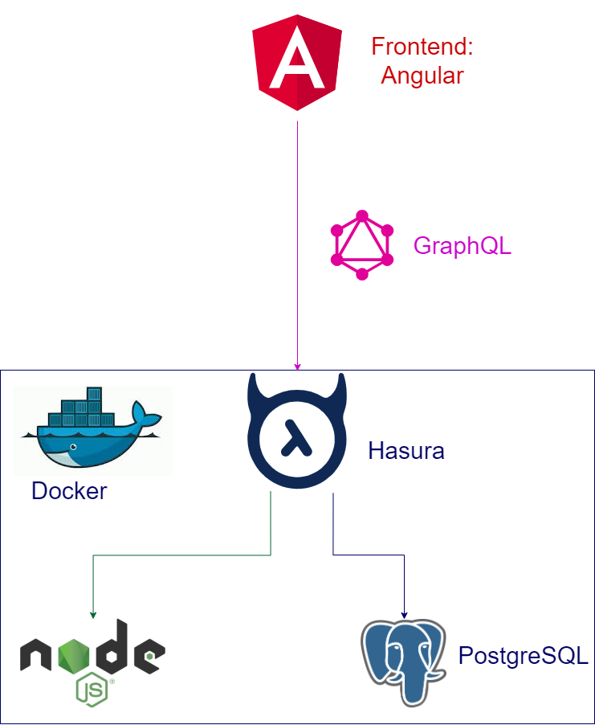

# Snippet Manager
## Description
Web platform to manage and share (code) snippets.

The frontend is beeing created using Angular and the backend is mainly implemented in Hasura.




### Requirements:
Docker-compose, nodejs@12,

## Quickstart
Install Hasura-CLI and start docker-compose:

`npm install && npm run hasura:start`

Wait for the postgres and hasura in docker to pull + start.
Then apply the project schema to the postgres via the hasura migration tool.
Afterwards start the admin web-app of hasura.

`npm run hasura:apply-schema && npm run hasura:console`

### ng the hasura schema from migrations (npm run hasura:apply-schema):

`$ hasura migrate apply`

This will apply all migrations inside the `haura/migrations/` to the postgres database.

### Launch the hasura console (npm run hasura:console):
```$ hasura console```

Here you can work on the project schema. Changes will be saved inside `hasura/migrations/`.
You can delete single migrations (e.g. if you created them by accident) by removing them from the directory.

You can also undo migrations via the cli. Check `$ hasura migrate --help` for further information.

